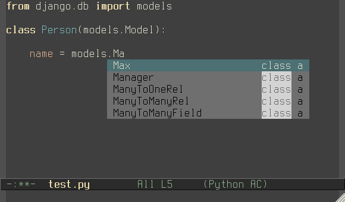

Auto-complete anaconda
======================

Anaconda_ source for auto-complete-mode_.

Installation
------------

You can install this package from Melpa_::

    M-x package-install RET ac-anaconda RET

Usage
-----

Add ``ac-source-anaconda`` to allowed ``ac-sources`` list

.. code:: lisp

    (add-hook 'python-mode-hook 'ac-anaconda-setup)

.. _Anaconda: https://github.com/anaconda-mode/anaconda-mode
.. _auto-complete-mode: https://github.com/auto-complete/auto-complete
.. _Melpa: http://melpa.milkbox.net/
